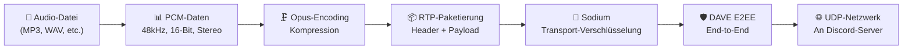
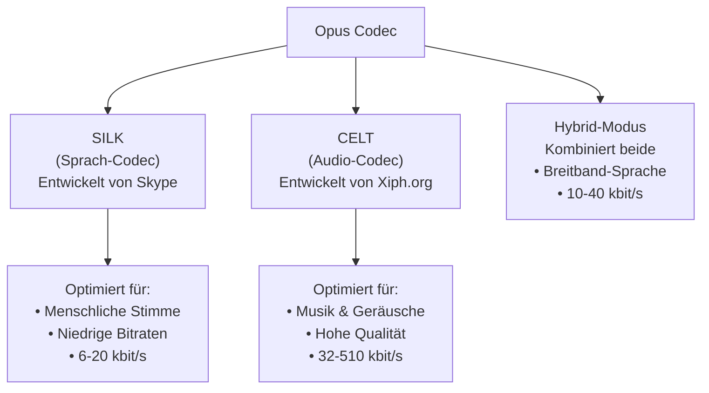
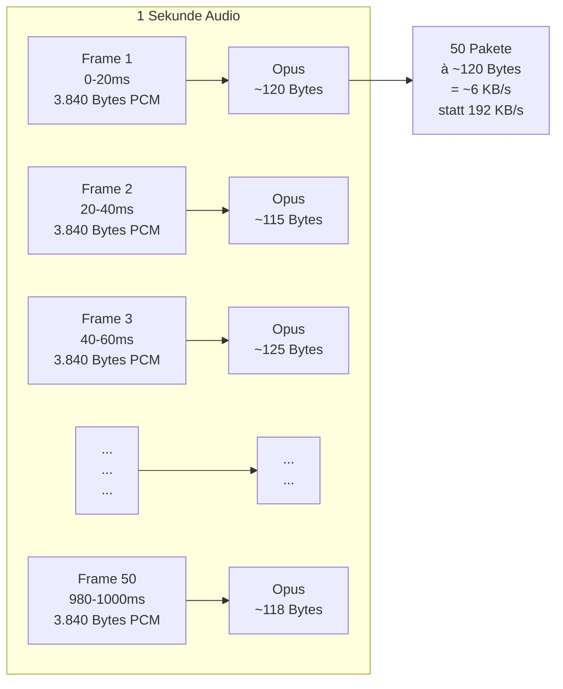
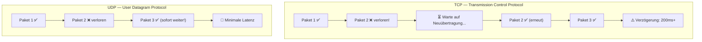
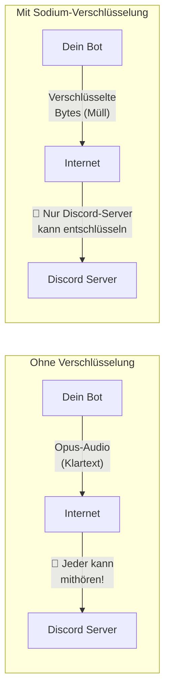
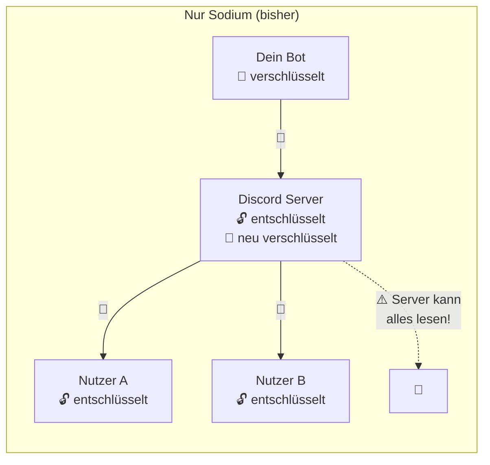
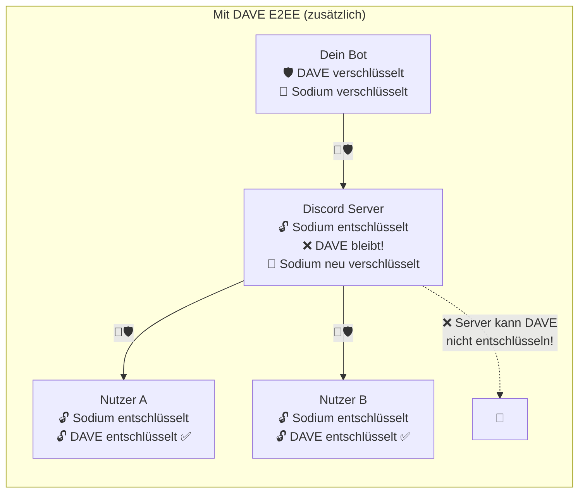
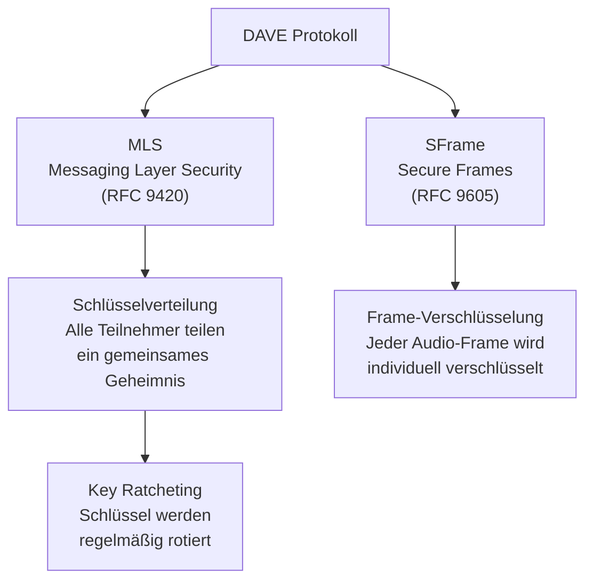
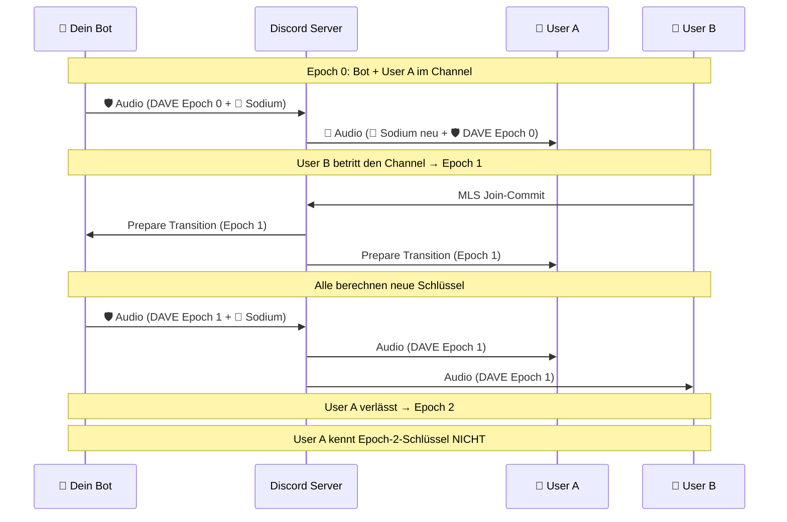
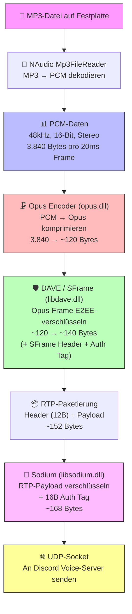

# Discord Audio-Pipeline: Von PCM bis zum Netzwerk

> **Detaillierte technische Dokumentation** der gesamten Audio-Verarbeitungskette in Discord-Bots  
> Zielgruppe: Entwickler, die jedes Detail verstehen wollen — ohne akademische Formeln, dafür mit C#-Code.

---

## Inhaltsverzeichnis

1. [Überblick: Die Audio-Pipeline](#1-überblick-die-audio-pipeline)
2. [PCM Audio — Das Rohmaterial](#2-pcm-audio--das-rohmaterial)
   - 2.1 [Was ist Schall?](#21-was-ist-schall)
   - 2.2 [Analog zu Digital: Sampling](#22-analog-zu-digital-sampling)
   - 2.3 [Bit-Tiefe: Quantisierung](#23-bit-tiefe-quantisierung)
   - 2.4 [Kanäle: Mono vs. Stereo](#24-kanäle-mono-vs-stereo)
   - 2.5 [PCM in der Praxis mit C#](#25-pcm-in-der-praxis-mit-c)
   - 2.6 [Warum Discord 48kHz/16-Bit/Stereo verlangt](#26-warum-discord-48khz16-bitstereo-verlangt)
3. [Opus Codec — Kompression](#3-opus-codec--kompression)
   - 3.1 [Warum komprimieren?](#31-warum-komprimieren)
   - 3.2 [Was ist Opus?](#32-was-ist-opus)
   - 3.3 [Wie Opus intern funktioniert](#33-wie-opus-intern-funktioniert)
   - 3.4 [Frames und Paketierung](#34-frames-und-paketierung)
   - 3.5 [Opus in C# simuliert](#35-opus-in-c-simuliert)
   - 3.6 [Opus-Konfiguration in Discord](#36-opus-konfiguration-in-discord)
4. [RTP — Das Transportprotokoll](#4-rtp--das-transportprotokoll)
   - 4.1 [Warum UDP und nicht TCP?](#41-warum-udp-und-nicht-tcp)
   - 4.2 [RTP-Header Aufbau](#42-rtp-header-aufbau)
   - 4.3 [RTP-Paket in C# bauen](#43-rtp-paket-in-c-bauen)
5. [Sodium Encryption — Transportverschlüsselung](#5-sodium-encryption--transportverschlüsselung)
   - 5.1 [Warum verschlüsseln?](#51-warum-verschlüsseln)
   - 5.2 [Was ist libsodium?](#52-was-ist-libsodium)
   - 5.3 [XSalsa20-Poly1305 erklärt](#53-xsalsa20-poly1305-erklärt)
   - 5.4 [Nonce: Die Einmalzahl](#54-nonce-die-einmalzahl)
   - 5.5 [Verschlüsselung in C# simuliert](#55-verschlüsselung-in-c-simuliert)
   - 5.6 [Discords Verschlüsselungsmodi](#56-discords-verschlüsselungsmodi)
6. [DAVE Protocol — End-to-End-Verschlüsselung](#6-dave-protocol--end-to-end-verschlüsselung)
   - 6.1 [Warum reicht Sodium nicht?](#61-warum-reicht-sodium-nicht)
   - 6.2 [Was ist DAVE?](#62-was-ist-dave)
   - 6.3 [MLS: Messaging Layer Security](#63-mls-messaging-layer-security)
   - 6.4 [Key Ratcheting: Schlüsselrotation](#64-key-ratcheting-schlüsselrotation)
   - 6.5 [SFrame: Die Frame-Verschlüsselung](#65-sframe-die-frame-verschlüsselung)
   - 6.6 [Epoch-Wechsel: Benutzer kommen und gehen](#66-epoch-wechsel-benutzer-kommen-und-gehen)
   - 6.7 [DAVE in C# simuliert](#67-dave-in-c-simuliert)
7. [Die komplette Pipeline zusammengefügt](#7-die-komplette-pipeline-zusammengefügt)
8. [Bezug zu deinem Projekt](#8-bezug-zu-deinem-projekt)

---

## 1. Überblick: Die Audio-Pipeline

Bevor ein einzelner Ton bei einem anderen Discord-Nutzer ankommt, durchläuft er eine mehrstufige Verarbeitungskette. Jede Stufe hat eine klar definierte Aufgabe:



| Schicht | Bibliothek | Zweck |
|---------|-----------|-------|
| Audio-Decoding | FFmpeg / NAudio | Quelldatei → PCM |
| Audio-Encoding | **opus.dll** | PCM → komprimiertes Opus |
| Transport-Verschlüsselung | **libsodium.dll** | Opus-Pakete verschlüsseln (Server kann entschlüsseln) |
| End-to-End-Verschlüsselung | **libdave.dll** | Zusätzliche Schicht (nur Teilnehmer können entschlüsseln) |

---

## 2. PCM Audio — Das Rohmaterial

### 2.1 Was ist Schall?

Schall ist eine **Druckwelle** in der Luft. Wenn du in die Hände klatschst, drückst du Luftmoleküle zusammen. Diese Verdichtung breitet sich wellenförmig aus — ähnlich wie Wellen auf einem See, wenn du einen Stein hineinwirfst.

Ein Mikrofon wandelt diese Druckwellen in ein **elektrisches Signal** um: eine Spannung, die sich über die Zeit verändert. Diese Spannung ist **analog** — sie ist ein kontinuierlicher, stufenloser Verlauf.

```
Schalldruck über Zeit (analog):

      +1.0 ┤      ╭──╮            ╭──╮
           │    ╭─╯  ╰─╮        ╭─╯  ╰─╮
       0.0 ┤───╯       ╰──╮  ╭─╯       ╰───
           │               ╰──╯
      -1.0 ┤
           └──────────────────────────────── Zeit →
```

### 2.2 Analog zu Digital: Sampling

Ein Computer kann keine kontinuierlichen Werte speichern. Er muss das analoge Signal **abtasten** — zu bestimmten Zeitpunkten den aktuellen Wert "fotografieren". Dieser Vorgang heißt **Sampling**.

Die **Sample-Rate** bestimmt, wie oft pro Sekunde gemessen wird:

| Sample-Rate | Messungen/Sekunde | Verwendung |
|------------|-------------------|------------|
| 8.000 Hz | 8.000 | Telefon |
| 22.050 Hz | 22.050 | Radio (niedrig) |
| 44.100 Hz | 44.100 | CD-Qualität |
| **48.000 Hz** | **48.000** | **Discord**, Blu-ray, professionelles Audio |
| 96.000 Hz | 96.000 | Studio-Produktion |

**Warum 48.000 Hz?** Das Nyquist-Shannon-Theorem besagt: Um eine Frequenz korrekt zu erfassen, muss die Sample-Rate **mindestens doppelt so hoch** sein wie die höchste zu übertragende Frequenz.

```csharp
// Das menschliche Ohr hört maximal bis ca. 20.000 Hz (20 kHz).
// Um 20.000 Hz korrekt abzutasten, braucht man:
int maxHörbareFrequenz = 20_000; // Hz
int minSampleRate = maxHörbareFrequenz * 2; // = 40.000 Hz

// Discord nutzt 48.000 Hz — etwas mehr als das Minimum.
// Der "Overhead" gibt Spielraum für Filter und verhindert Artefakte.
int discordSampleRate = 48_000;
```

Stell dir das so vor: Du willst eine Sinuswelle zeichnen, die 10 Mal pro Sekunde schwingt. Wenn du nur 10 Fotos pro Sekunde machst, könnte jedes Foto zufällig den gleichen Punkt der Welle treffen — die Welle wäre unsichtbar. Mit 20+ Fotos pro Sekunde kannst du die Welle erkennen.

```
48.000 Samples pro Sekunde:

Amplitude
  +1.0 ┤  ●   ●                      ●   ●
       │ ●  ● ● ●                  ● ●  ● ●
   0.0 ┤●        ●  ●          ●  ●        ●
       │           ● ● ●    ● ● ●
  -1.0 ┤              ●  ●●  ●
       └─────────────────────────────────────── Zeit →
       Jedes ● ist ein Sample (eine Messung)
```

### 2.3 Bit-Tiefe: Quantisierung

Jedes Sample ist ein **Zahlenwert**, der die Amplitude (Lautstärke/Ausschlag) zu diesem Zeitpunkt beschreibt. Die **Bit-Tiefe** bestimmt, wie viele verschiedene Werte möglich sind:

| Bit-Tiefe | Mögliche Werte | Wertebereich | Dynamikumfang |
|-----------|----------------|-------------|---------------|
| 8 Bit | 256 | 0 bis 255 (unsigned) | ~48 dB |
| **16 Bit** | **65.536** | **-32.768 bis +32.767** | **~96 dB** |
| 24 Bit | 16.777.216 | -8.388.608 bis +8.388.607 | ~144 dB |
| 32 Bit (float) | ~4 Milliarden | -1.0 bis +1.0 | ~192 dB |

```csharp
// Bei 16-Bit PCM: Jedes Sample ist ein short (Int16)
short stille = 0;                // Kein Ausschlag
short maxLaut = short.MaxValue;  // +32.767 → maximale positive Amplitude
short maxLeise = short.MinValue; // -32.768 → maximale negative Amplitude

// Beispiel: Eine Sinuswelle bei halber Lautstärke
double amplitude = 0.5; // 50% der Maximallautstärke
double frequenz = 440.0; // Hz (Kammerton A)
int sampleRate = 48_000;

short[] GeneriereSinuswelle(double freq, double amp, int dauer_ms)
{
    int anzahlSamples = sampleRate * dauer_ms / 1000;
    var samples = new short[anzahlSamples];

    for (int i = 0; i < anzahlSamples; i++)
    {
        // Zeitpunkt dieses Samples in Sekunden
        double t = (double)i / sampleRate;

        // Sinuswert: schwingt zwischen -1.0 und +1.0
        double sinWert = Math.Sin(2.0 * Math.PI * freq * t);

        // Skalieren auf 16-Bit Bereich und Lautstärke anwenden
        samples[i] = (short)(sinWert * amp * short.MaxValue);
    }
    return samples;
}

// Ergebnis: Array mit 48.000 short-Werten pro Sekunde
// Bei 440 Hz erzeugt das einen reinen Kammerton A
```

**Quantisierungsfehler**: Da wir eine kontinuierliche Welle auf diskrete Stufen abbilden, geht minimal Information verloren. Bei 16 Bit mit 65.536 Stufen ist dieser Fehler so klein, dass er unhörbar ist.

```
16-Bit Quantisierung:

Originalsignal (glatte Kurve):        Quantisiert (Treppenstufen):
         ╭──╮                                ┌──┐
       ╭─╯  ╰─╮                           ┌──┘  └──┐
    ──╯       ╰──                       ───┘        └───
                                     
    Jede "Stufe" ist 1/65.536 des Gesamtbereichs
    → bei 16 Bit praktisch unhörbar
```

### 2.4 Kanäle: Mono vs. Stereo

Audio kann in mehreren **Kanälen** vorliegen:

- **Mono (1 Kanal)**: Ein einziger Audio-Stream. Aus beiden Lautsprechern kommt das Gleiche.
- **Stereo (2 Kanäle)**: Zwei separate Streams — Links (L) und Rechts (R). Ermöglicht räumliches Hören.

Bei Stereo-PCM werden die Samples **interleaved** (verschachtelt) gespeichert:

```csharp
// Mono: Ein Sample nach dem anderen
// [S1] [S2] [S3] [S4] [S5] ...
short[] mono = { 100, 200, 150, -50, -200 };

// Stereo: Links und Rechts abwechselnd
// [L1] [R1] [L2] [R2] [L3] [R3] ...
short[] stereo = { 100, 80,   // Sample 1: Links=100, Rechts=80
                   200, 190,  // Sample 2: Links=200, Rechts=190
                   150, 160,  // Sample 3: Links=150, Rechts=160
                  -50, -40,   // Sample 4
                  -200, -180  // Sample 5
                 };

// Bei Stereo: Doppelt so viele short-Werte pro Sekunde!
int monoSamplesProSekunde = 48_000;      // 48.000 shorts
int stereoSamplesProSekunde = 48_000 * 2; // 96.000 shorts
```

### 2.5 PCM in der Praxis mit C#

PCM (Pulse Code Modulation) ist also nichts anderes als ein **rohes Array von Zahlenwerten**, die Schalldruckpunkte zu gleichmäßigen Zeitpunkten darstellen.

```csharp
// Discord erwartet: 48kHz, 16-Bit, Stereo, Little-Endian
// Das bedeutet:
int sampleRate = 48_000;      // 48.000 Messungen pro Sekunde pro Kanal
int bitsPerSample = 16;       // Jeder Messwert ist ein short (2 Bytes)
int channels = 2;             // Stereo (Links + Rechts)

// Datenrate berechnen:
int bytesProSample = bitsPerSample / 8;              // = 2 Bytes
int bytesProSekunde = sampleRate * bytesPerSample * channels; // = 192.000 Bytes/s

// Das sind ~192 KB pro Sekunde rohes, unkomprimiertes Audio!
// Für einen 3-Minuten Song:
long bytesGesamt = bytesProSekunde * 180L; // = 34.560.000 Bytes ≈ 34,6 MB

// So sieht ein PCM byte-Array intern aus (Little-Endian):
short sampleWert = 1000; // Amplitudenwert
byte lowByte = (byte)(sampleWert & 0xFF);        // = 0xE8 (232)
byte highByte = (byte)((sampleWert >> 8) & 0xFF); // = 0x03 (3)
// Im Speicher: [0xE8, 0x03] → Little-Endian: niedrigstes Byte zuerst

// Umgekehrt: Bytes zurück zu short
short wiederhergestellt = (short)(lowByte | (highByte << 8)); // = 1000 ✓
```

**Little-Endian** bedeutet: Das niedrigwertigste Byte kommt zuerst. Die Zahl `1000` (hexadezimal `0x03E8`) wird als `[0xE8, 0x03]` gespeichert — der "kleine" Teil (`E8`) kommt vor dem "großen" (`03`).

```csharp
// Komplettes Beispiel: Eine Sekunde Stille als PCM-Daten
byte[] EineSekundeStille()
{
    int sampleRate = 48_000;
    int channels = 2;
    int bytesPerSample = 2; // 16-Bit

    // Gesamtanzahl Bytes für 1 Sekunde
    int totalBytes = sampleRate * channels * bytesPerSample; // 192.000

    // Stille = alle Werte sind 0
    return new byte[totalBytes]; // Automatisch mit 0 gefüllt
}

// Beispiel: PCM aus einer MP3-Datei mit NAudio lesen (wie in deinem Bot)
async Task<byte[]> LesePcmAusDatei(string pfad)
{
    using var reader = new NAudio.Wave.Mp3FileReader(pfad);
    // reader.WaveFormat enthält: SampleRate, BitsPerSample, Channels
    // reader liefert PCM-Bytes beim Lesen

    using var memStream = new MemoryStream();
    await reader.CopyToAsync(memStream);
    return memStream.ToArray(); // Rohes PCM
}
```

### 2.6 Warum Discord 48kHz/16-Bit/Stereo verlangt

Discord hat sich für dieses Format entschieden, weil:

1. **48 kHz**: Standard für Video/Streaming-Industrie (Blu-ray, YouTube). Opus ist dafür optimiert.
2. **16-Bit**: Genug Dynamikumfang (96 dB) für Sprache und Musik. 24-Bit wäre Verschwendung bei Streaming.
3. **Stereo**: Erlaubt räumliche Audio-Effekte (z.B. verschiedene Nutzer auf unterschiedlichen Positionen im Stereofeld).

---

## 3. Opus Codec — Kompression

### 3.1 Warum komprimieren?

Die rohen PCM-Daten sind riesig:

```csharp
// PCM-Datenrate für Discord-Audio:
int pcmBytesProSekunde = 48_000 * 2 * 2; // = 192.000 Bytes/s = 1.536 kbit/s

// Opus komprimiert auf typisch:
int opusBytesProSekunde = 8_000; // ≈ 64 kbit/s (Discord Standard)

// Kompressionsrate:
double ratio = (double)pcmBytesProSekunde / opusBytesProSekunde; // = 24x kleiner!

// Für 100 Nutzer im Voice-Channel gleichzeitig:
long ohnKompression = 100L * 192_000; // = 19.200.000 Bytes/s = 153,6 Mbit/s 😱
long mitKompression = 100L * 8_000;    // = 800.000 Bytes/s = 6,4 Mbit/s ✅
```

Ohne Kompression wäre Echtzeit-Audio über das Internet schlicht nicht machbar.

### 3.2 Was ist Opus?

Opus ist ein **offener, lizenzfreier Audio-Codec**, der 2012 von der IETF standardisiert wurde (RFC 6716). Er wurde speziell für **Echtzeit-Kommunikation** entwickelt und vereint zwei Technologien:



| Eigenschaft | Opus | MP3 | AAC |
|------------|------|-----|-----|
| Latenz | **2,5 ms – 60 ms** | ~100 ms | ~20 ms |
| Bitraten | 6 – 510 kbit/s | 32 – 320 kbit/s | 8 – 256 kbit/s |
| Sample-Rates | 8 – 48 kHz | 8 – 48 kHz | 8 – 96 kHz |
| Echtzeit-tauglich | **Ja** ✅ | Nein ❌ | Bedingt |
| Lizenzfrei | **Ja** ✅ | Nein | Nein |

### 3.3 Wie Opus intern funktioniert

Opus arbeitet in zwei Hauptphasen:

#### Phase 1: Analyse — Was steckt im Audio?

```csharp
// Opus analysiert jeden Frame und entscheidet:
enum OpusSignalTyp
{
    Sprache,   // → SILK-Encoder (Linear Predictive Coding)
    Musik,     // → CELT-Encoder (Modified Discrete Cosine Transform)
    Hybrid     // → Beide kombiniert
}

// Konzeptuell macht Opus sowas:
OpusSignalTyp AnalysiereFrame(short[] pcmFrame)
{
    // 1. Tonalitätserkennung: Sind klare Frequenzmuster da? → Musik
    // 2. Sprachmuster: Gibt es Formanten (Resonanzen des Vokaltrakts)? → Sprache
    // 3. Bandbreite: Wieviel Frequenzbereich wird genutzt?

    double tonalitaet = BerechneSpektraleFlachheit(pcmFrame);
    bool hatFormanten = ErkenneVokaltrakt(pcmFrame);

    if (hatFormanten && tonalitaet < 0.3)
        return OpusSignalTyp.Sprache;
    else if (tonalitaet > 0.7)
        return OpusSignalTyp.Musik;
    else
        return OpusSignalTyp.Hybrid;
}
```

#### Phase 2a: SILK (für Sprache) — Lineare Prädiktive Codierung

SILK nutzt die Tatsache, dass menschliche Sprache **vorhersagbar** ist. Der Vokaltrakt (Mund, Rachen, Nase) ist ein physisches System, das sich nur langsam ändert:

```csharp
// Grundidee der Linearen Prädiktiven Codierung (LPC):
// "Sage das nächste Sample vorher, basierend auf den vorherigen."

short PrediziereSample(short[] vorherigesamples, double[] koeffizienten)
{
    // Ein LPC-Filter sagt: Das nächste Sample ist eine gewichtete Summe
    // der vorherigen Samples
    double vorhersage = 0;
    for (int i = 0; i < koeffizienten.Length; i++)
    {
        vorhersage += koeffizienten[i] * vorherigesamples[vorherigesamples.Length - 1 - i];
    }
    return (short)vorhersage;
}

// Statt ALLE Samples zu übertragen, überträgt SILK nur:
// 1. Die Filter-Koeffizienten (wenige Zahlen, beschreiben die "Form" des Vokaltrakts)
// 2. Den Vorhersagefehler (Residuum = tatsächlich - vorhergesagt)
// 3. Die Grundfrequenz (Pitch) der Stimme

// Beispiel: 160 Samples (20ms bei 8kHz) werden zu vielleicht 20-30 Bytes
// Weil der Fehler zwischen Vorhersage und Realität klein ist,
// braucht er viel weniger Bits als das Original.

void SilkEncode(short[] pcmFrame)
{
    // 1. Finde die besten Koeffizienten für diesen Frame
    double[] koeff = BerechneLPCKoeffizienten(pcmFrame, ordnung: 16);

    // 2. Berechne die Vorhersage für jedes Sample
    short[] vorhersage = new short[pcmFrame.Length];
    for (int i = 16; i < pcmFrame.Length; i++)
        vorhersage[i] = PrediziereSample(pcmFrame, koeff);

    // 3. Berechne den Fehler (Residuum)
    short[] fehler = new short[pcmFrame.Length];
    for (int i = 0; i < pcmFrame.Length; i++)
        fehler[i] = (short)(pcmFrame[i] - vorhersage[i]);

    // 4. Übertrage: Koeffizienten + quantisierter Fehler
    // Der Fehler ist viel kleiner als das Original → weniger Bits nötig!
}
```

#### Phase 2b: CELT (für Musik) — Modifizierte Diskrete Kosinustransformation

CELT arbeitet im **Frequenzbereich**. Es zerlegt das Audio in seine Frequenzanteile:

```csharp
// Grundidee: Statt Samples über die Zeit zu speichern,
// speichern wir WIE STARK jede Frequenz vorhanden ist.

// Stell dir vor du hörst einen Akkord: C + E + G
// Im Zeitbereich: komplexes Wellengemisch (schwer zu komprimieren)
// Im Frequenzbereich: drei Spitzen bei 262Hz, 330Hz, 392Hz (einfach!)

void CeltEncode(short[] pcmFrame)
{
    // 1. Modified Discrete Cosine Transform (MDCT)
    //    Wandelt Zeit-Samples in Frequenz-Koeffizienten um
    double[] frequenzKoeffizienten = MDCT(pcmFrame);
    // Aus z.B. 960 Samples werden 960 Frequenzwerte

    // 2. Aufteilen in "Bänder" (Bark-Skala, angelehnt an menschliches Hören)
    //    Tiefe Frequenzen: schmale Bänder (das Ohr hört da genauer)
    //    Hohe Frequenzen: breite Bänder (das Ohr ist da ungenauer)
    double[][] baender = TeilInBaenderAuf(frequenzKoeffizienten);
    // z.B. Band 0: 0-100Hz, Band 1: 100-200Hz, ..., Band 20: 16000-20000Hz

    // 3. Energie pro Band berechnen
    double[] bandEnergie = new double[baender.Length];
    for (int b = 0; b < baender.Length; b++)
    {
        bandEnergie[b] = 0;
        foreach (var koeff in baender[b])
            bandEnergie[b] += koeff * koeff;
    }

    // 4. Bit-Allokation: Bänder mit mehr Energie bekommen mehr Bits
    //    (Psychoakustisches Modell: was das Ohr nicht hört, wird weggelassen)
    int[] bitsProBand = VerteileBits(bandEnergie, verfuegbareBits: 640);

    // 5. Quantisiere und kodiere jedes Band mit der zugewiesenen Bit-Anzahl
    byte[] komprimiert = KodiereBaender(baender, bitsProBand);
}
```

**Psychoakustisches Modell**: CELT nutzt Eigenschaften des menschlichen Gehörs:

```csharp
// Maskierung: Ein lauter Ton "überdeckt" leisere Töne in der Nähe
// Beispiel: Bei einem lauten 1000Hz-Ton hörst du einen leisen 1100Hz-Ton nicht

bool IstMaskiert(double frequenz, double lautstaerke, 
                  double maskiererFrequenz, double maskiererLautstaerke)
{
    double abstand = Math.Abs(frequenz - maskiererFrequenz);
    double maskierungsSchwelle = maskiererLautstaerke - (abstand * 0.1);
    
    // Wenn die Lautstärke unter der Maskierungsschwelle liegt:
    // → Diesen Ton muss man nicht übertragen, man hört ihn sowieso nicht!
    return lautstaerke < maskierungsSchwelle;
}

// Dadurch kann CELT Daten weglassen, die unhörbar sind → bessere Kompression
```

### 3.4 Frames und Paketierung

Opus arbeitet mit **Frames** — kleinen Zeitabschnitten des Audios:

```csharp
// Discord nutzt 20ms Frames (Standard für VoIP)
int frameDauerMs = 20;
int sampleRate = 48_000;
int channels = 2;

// Samples pro Frame:
int samplesProFrame = sampleRate * frameDauerMs / 1000; // = 960 pro Kanal
int totalSamples = samplesProFrame * channels; // = 1.920 (Stereo, interleaved)

// Bytes pro Frame (PCM, 16-Bit):
int pcmBytesProFrame = totalSamples * 2; // = 3.840 Bytes

// Nach Opus-Encoding: typisch 50-200 Bytes pro Frame!
// Das ist eine ~20x bis ~75x Reduktion pro Frame.

// Frames pro Sekunde:
int framesProSekunde = 1000 / frameDauerMs; // = 50 Frames/s
// → 50 Opus-Pakete pro Sekunde werden an Discord geschickt
```



### 3.5 Opus in C# simuliert

So würde ein Opus-Encoder/Decoder konzeptuell aussehen (die echte Arbeit macht `opus.dll` nativ):

```csharp
// Discord.Net ruft intern sowas auf:
// (Vereinfacht — die echte API ist ein C-Interop via P/Invoke)

class OpusEncoder : IDisposable
{
    private IntPtr _encoderPtr; // Zeiger auf den nativen Opus-Encoder

    public OpusEncoder(int sampleRate, int channels, int application)
    {
        // Erstellt einen nativen Opus-Encoder
        // application: OPUS_APPLICATION_VOIP (2048) oder OPUS_APPLICATION_AUDIO (2049)
        _encoderPtr = NativeMethods.opus_encoder_create(
            sampleRate,    // 48000
            channels,      // 2
            application,   // 2049 für Musik (Discord nutzt das)
            out int error
        );
    }

    public byte[] Encode(short[] pcmFrame)
    {
        // pcmFrame: 1920 shorts (960 Samples × 2 Kanäle)
        byte[] output = new byte[4000]; // Maximale Ausgabegröße

        int encodedBytes = NativeMethods.opus_encode(
            _encoderPtr,
            pcmFrame,           // 1920 PCM-Samples (20ms Stereo)
            960,                // Samples pro Kanal
            output,
            output.Length
        );

        // encodedBytes ist typisch 50-200 Bytes
        return output[..encodedBytes];
    }

    public void Dispose()
    {
        NativeMethods.opus_encoder_destroy(_encoderPtr);
    }
}

// So werden die nativen Funktionen aus opus.dll aufgerufen:
static class NativeMethods
{
    [DllImport("opus", CallingConvention = CallingConvention.Cdecl)]
    public static extern IntPtr opus_encoder_create(
        int sampleRate, int channels, int application, out int error);

    [DllImport("opus", CallingConvention = CallingConvention.Cdecl)]
    public static extern int opus_encode(
        IntPtr encoder, short[] pcm, int frameSize, byte[] data, int maxDataBytes);

    [DllImport("opus", CallingConvention = CallingConvention.Cdecl)]
    public static extern void opus_encoder_destroy(IntPtr encoder);
}
```

### 3.6 Opus-Konfiguration in Discord

```csharp
// Discord.Net konfiguriert Opus so:
enum AudioApplication
{
    Voice = 2048,  // OPUS_APPLICATION_VOIP → optimiert für Sprache
    Music = 2049,  // OPUS_APPLICATION_AUDIO → optimiert für Musik
    Mixed = 2051   // OPUS_APPLICATION_RESTRICTED_LOWDELAY
}

// Dein Bot nutzt:
var stream = audioClient.CreatePCMStream(AudioApplication.Music);
// → Opus wird im Musik-Modus betrieben (CELT bevorzugt, höhere Qualität)

// Discord's Standard-Bitrate: 64 kbit/s (konfigurierbar bis 384 kbit/s)
// Bei 64 kbit/s und 50 Frames/s = ~160 Bytes pro Opus-Frame
```

---

## 4. RTP — Das Transportprotokoll

### 4.1 Warum UDP und nicht TCP?



| Eigenschaft | TCP | UDP |
|------------|-----|-----|
| Zuverlässigkeit | Garantierte Zustellung | Pakete können verloren gehen |
| Reihenfolge | Garantiert | Nicht garantiert |
| Latenz | Hoch (wegen Neuübertragungen) | **Niedrig** ✅ |
| Für Audio? | ❌ Ungeeignet | ✅ Perfekt |

**Warum?** Bei Audio ist ein verlorenes Paket (20ms Stille) besser als 200ms Verzögerung. Das Gehirn kompensiert kurze Lücken, aber Latenz macht Gespräche unmöglich.

```csharp
// Opus hat eingebaute Paketverlustkompensation (PLC):
// Wenn Frame 5 verloren geht, kann der Decoder trotzdem Audio erzeugen

byte[] OpusDecodeWithPLC(byte[]? empfangenesFrame)
{
    if (empfangenesFrame is null)
    {
        // Paket verloren → Opus interpoliert aus vorherigen Frames
        // "Packet Loss Concealment": erzeugt plausibles Audio
        return NativeMethods.opus_decode(decoder, null, 0, output, 960, decodeFec: 1);
    }
    return NativeMethods.opus_decode(decoder, empfangenesFrame, empfangenesFrame.Length, output, 960, decodeFec: 0);
}
```

### 4.2 RTP-Header Aufbau

**RTP** (Real-time Transport Protocol, RFC 3550) ist ein Protokoll, das **auf UDP aufsetzt** und Audio-Frames mit Metadaten versieht:

```
 0                   1                   2                   3
 0 1 2 3 4 5 6 7 8 9 0 1 2 3 4 5 6 7 8 9 0 1 2 3 4 5 6 7 8 9 0 1
+-+-+-+-+-+-+-+-+-+-+-+-+-+-+-+-+-+-+-+-+-+-+-+-+-+-+-+-+-+-+-+-+
|V=2|P|X|  CC   |M|     PT      |       Sequence Number         |
+-+-+-+-+-+-+-+-+-+-+-+-+-+-+-+-+-+-+-+-+-+-+-+-+-+-+-+-+-+-+-+-+
|                           Timestamp                           |
+-+-+-+-+-+-+-+-+-+-+-+-+-+-+-+-+-+-+-+-+-+-+-+-+-+-+-+-+-+-+-+-+
|                             SSRC                              |
+-+-+-+-+-+-+-+-+-+-+-+-+-+-+-+-+-+-+-+-+-+-+-+-+-+-+-+-+-+-+-+-+
|                     Opus-Daten (Payload)                      |
|                            ...                                |
+-+-+-+-+-+-+-+-+-+-+-+-+-+-+-+-+-+-+-+-+-+-+-+-+-+-+-+-+-+-+-+-+
```

```csharp
// Die Felder im Detail:
class RtpHeader
{
    // V (Version): Immer 2 (aktuelle RTP-Version)
    public byte Version = 2;

    // P (Padding): Gibt an ob am Ende Füllbytes stehen
    public bool Padding = false;

    // X (Extension): Gibt an ob ein Header-Extension folgt
    // Discord nutzt dies für zusätzliche Metadaten
    public bool Extension = true;

    // CC (CSRC Count): Anzahl der CSRC-Einträge (bei Discord immer 0)
    public byte CsrcCount = 0;

    // M (Marker): Signalisiert den Anfang eines neuen "Gesprächsabschnitts"
    // z.B. nach einer Pause → erstes Paket nach Stille hat M=1
    public bool Marker = false;

    // PT (Payload Type): Art des Audio-Codecs
    // Discord nutzt 120 für Opus
    public byte PayloadType = 120;

    // Sequence Number: Laufende Nummer (0-65535, dann Überlauf)
    // Ermöglicht Erkennung von Paketverlust und Sortierung
    public ushort SequenceNumber;

    // Timestamp: Zeitstempel in Sampleeinheiten
    // Pro 20ms Frame: +960 (bei 48kHz)
    // Ermöglicht präzise zeitliche Einordnung
    public uint Timestamp;

    // SSRC (Synchronization Source): Eindeutige ID des Senders
    // Discord weist jedem Bot/User eine SSRC zu
    public uint Ssrc;
}
```

### 4.3 RTP-Paket in C# bauen

```csharp
byte[] BaueRtpPaket(ushort sequenceNr, uint timestamp, uint ssrc, byte[] opusPayload)
{
    // RTP-Header ist 12 Bytes
    byte[] paket = new byte[12 + opusPayload.Length];

    // Byte 0: Version(2) | Padding(0) | Extension(0) | CC(0) = 0b10_0_0_0000 = 0x80
    paket[0] = 0x80;

    // Byte 1: Marker(0) | PayloadType(120) = 0b0_1111000 = 0x78
    paket[1] = 0x78;

    // Bytes 2-3: Sequence Number (Big-Endian / Network Byte Order!)
    paket[2] = (byte)(sequenceNr >> 8);   // High Byte zuerst
    paket[3] = (byte)(sequenceNr & 0xFF); // Low Byte danach

    // Bytes 4-7: Timestamp (Big-Endian)
    paket[4] = (byte)(timestamp >> 24);
    paket[5] = (byte)(timestamp >> 16);
    paket[6] = (byte)(timestamp >> 8);
    paket[7] = (byte)(timestamp & 0xFF);

    // Bytes 8-11: SSRC (Big-Endian)
    paket[8]  = (byte)(ssrc >> 24);
    paket[9]  = (byte)(ssrc >> 16);
    paket[10] = (byte)(ssrc >> 8);
    paket[11] = (byte)(ssrc & 0xFF);

    // Ab Byte 12: Opus-Daten
    Buffer.BlockCopy(opusPayload, 0, paket, 12, opusPayload.Length);

    return paket;
}

// Beispiel: Pakete über Zeit
void SendeAudio(byte[][] opusFrames, uint ssrc)
{
    ushort seq = 0;
    uint timestamp = 0;

    foreach (var frame in opusFrames)
    {
        byte[] paket = BaueRtpPaket(seq, timestamp, ssrc, frame);
        // udpClient.Send(paket, paket.Length);

        seq++;                // Nächste Sequenznummer
        timestamp += 960;     // +960 Samples (= 20ms bei 48kHz)
    }
}
```

---

## 5. Sodium Encryption — Transportverschlüsselung

### 5.1 Warum verschlüsseln?

Ohne Verschlüsselung könnte jeder, der den Netzwerkverkehr abfängt (z.B. im gleichen WLAN), dein Audio mithören. Die Opus-Daten im RTP-Paket sind kein Schutz — sie sind direkt abspielbar.



### 5.2 Was ist libsodium?

**libsodium** ist eine kryptographische Bibliothek, die einfach zu nutzende, sichere Verschlüsselungsfunktionen bereitstellt. Discord nutzt daraus speziell **XSalsa20-Poly1305** — eine Kombination aus:

- **XSalsa20**: Ein **Stromchiffre** (Stream Cipher) — verschlüsselt Daten beliebiger Länge
- **Poly1305**: Ein **Message Authentication Code (MAC)** — stellt sicher, dass niemand die Daten manipuliert hat

### 5.3 XSalsa20-Poly1305 erklärt

#### XSalsa20: Die Stromchiffre

Eine Stromchiffre funktioniert wie ein **Einmalblock** (One-Time Pad): Sie erzeugt einen pseudozufälligen Bytestrom und **XOR-verknüpft** ihn mit den Daten.

```csharp
// XOR ist die zentrale Operation:
// Eigenschaft: A XOR B XOR B = A (XOR ist sein eigenes Gegenteil!)

byte Xor(byte a, byte b) => (byte)(a ^ b);

// Verschlüsselung:
byte klartext    = 0b_1010_0011; // 163
byte schluessel  = 0b_1100_0101; // 197
byte chiffretext = Xor(klartext, schluessel); // 0b_0110_0110 = 102

// Entschlüsselung (gleiche Operation!):
byte entschluesselt = Xor(chiffretext, schluessel); // 0b_1010_0011 = 163 ✅

// XSalsa20 erzeugt aus einem 32-Byte Schlüssel + 24-Byte Nonce
// einen pseudozufälligen Bytestrom beliebiger Länge.
// Dieser Stream wird per XOR mit den Daten verknüpft.

byte[] XSalsa20Verschluesseln(byte[] klartext, byte[] schluessel32, byte[] nonce24)
{
    // 1. Erzeuge Schlüsselstrom aus Schlüssel + Nonce
    byte[] schluesselstrom = GeneriereSchluesselstrom(schluessel32, nonce24, klartext.Length);

    // 2. XOR jedes Byte
    byte[] chiffretext = new byte[klartext.Length];
    for (int i = 0; i < klartext.Length; i++)
    {
        chiffretext[i] = (byte)(klartext[i] ^ schluesselstrom[i]);
    }
    return chiffretext;
}
```

#### Wie XSalsa20 den Schlüsselstrom erzeugt

XSalsa20 arbeitet intern mit einer **4×4 Matrix** aus 32-Bit Wörtern:

```csharp
// Die Matrix wird so initialisiert:
uint[,] InitialisiereMatrix(byte[] schluessel32, byte[] nonce24)
{
    // 16 Wörter à 32 Bit = 512 Bit = 64 Bytes pro Block
    uint[,] matrix = new uint[4, 4];

    // Zeile 0: Konstante "expand 32-byte k" (als 4 uint-Wörter)
    matrix[0, 0] = 0x61707865; // "expa"
    matrix[0, 1] = 0x3320646E; // "nd 3"
    matrix[0, 2] = 0x79622D32; // "2-by"
    matrix[0, 3] = 0x6B206574; // "te k"

    // Zeile 1 + 2: 256-Bit Schlüssel (8 Wörter)
    // (Die 32 Bytes des Schlüssels, aufgeteilt in uint-Wörter)

    // Zeile 3: Nonce (24 Bytes) + Block-Counter

    return matrix;
}

// Dann werden 20 Runden "Quarter-Round" Operationen durchgeführt:
void QuarterRound(ref uint a, ref uint b, ref uint c, ref uint d)
{
    // Jede Quarter-Round mischt 4 Wörter durch:
    // Addition, XOR und Bit-Rotation

    a += b; d ^= a; d = RotateLeft(d, 16);
    c += d; b ^= c; b = RotateLeft(b, 12);
    a += b; d ^= a; d = RotateLeft(d, 8);
    c += d; b ^= c; b = RotateLeft(b, 7);
}

uint RotateLeft(uint wert, int bits)
{
    return (wert << bits) | (wert >> (32 - bits));
}

// Nach 20 Runden (10× Spalten + 10× Diagonalen) ist das Ergebnis
// ein 64-Byte Block, der wie zufällig aussieht.
// Für längere Daten: Block-Counter erhöhen → nächster 64-Byte Block
```

#### Poly1305: Der Authentifizierungscode

Verschlüsselung allein verhindert nicht, dass jemand die verschlüsselten Bytes **verändert** (z.B. zufällig flippt). Poly1305 erzeugt einen 16-Byte **Tag**, der beweist, dass die Nachricht unverändert ist:

```csharp
// Poly1305 berechnet einen 16-Byte Authentifizierungstag
byte[] Poly1305Tag(byte[] nachricht, byte[] einmalSchluessel32)
{
    // Intern: Die Nachricht wird als Polynom interpretiert
    // und an einem geheimen Punkt ausgewertet.
    //
    // Konzeptuell (vereinfacht):
    // Die Nachricht wird in 16-Byte Blöcke aufgeteilt: m1, m2, m3, ...
    // Ein Schlüssel r wird extrahiert
    // Berechnung: ((m1 * r + m2) * r + m3) * r + ... mod p
    // Das Ergebnis ist der 16-Byte Tag

    // Wenn auch nur 1 Bit der Nachricht verändert wird,
    // ändert sich der Tag komplett → Manipulation erkannt!

    return tag; // 16 Bytes
}

// Zusammen ergibt sich:
byte[] VerschluesselnMitAuth(byte[] klartext, byte[] schluessel32, byte[] nonce24)
{
    // 1. Verschlüsseln mit XSalsa20
    byte[] chiffretext = XSalsa20Verschluesseln(klartext, schluessel32, nonce24);

    // 2. Authentifizierungstag berechnen
    byte[] tag = Poly1305Tag(chiffretext, schluessel32);

    // 3. Ergebnis: Tag (16 Bytes) + Chiffretext
    byte[] ergebnis = new byte[16 + chiffretext.Length];
    Buffer.BlockCopy(tag, 0, ergebnis, 0, 16);
    Buffer.BlockCopy(chiffretext, 0, ergebnis, 16, chiffretext.Length);
    return ergebnis;
}
```

### 5.4 Nonce: Die Einmalzahl

Die **Nonce** (Number used ONCE) ist entscheidend: Sie stellt sicher, dass derselbe Klartext jedes Mal anders verschlüsselt wird.

```csharp
// KRITISCH: Eine Nonce darf NIEMALS mit dem gleichen Schlüssel wiederverwendet werden!
// Sonst: Schlüsselstrom1 = Schlüsselstrom2
// → Chiffretext1 XOR Chiffretext2 = Klartext1 XOR Klartext2
// → Ein Angreifer kann beide Klartexte rekonstruieren!

// Discord nutzt die RTP-Sequence-Number als Nonce-Basis:
byte[] ErstelleNonce(ushort sequenceNr)
{
    // Die Nonce ist 24 Bytes lang
    byte[] nonce = new byte[24];

    // Die Sequence Number wird in die ersten Bytes geschrieben
    // Der Rest bleibt 0
    nonce[0] = (byte)(sequenceNr >> 8);
    nonce[1] = (byte)(sequenceNr & 0xFF);

    // Da die Sequence Number immer aufsteigend ist (0, 1, 2, 3, ...),
    // ist jede Nonce automatisch einmalig für diesen Schlüssel.
    return nonce;
}

// Der Schlüssel wird beim Voice-Handshake über den WebSocket ausgetauscht
// (der WebSocket ist seinerseits TLS-verschlüsselt)
```

### 5.5 Verschlüsselung in C# simuliert

So sieht der gesamte Prozess eines einzelnen Voice-Pakets aus:

```csharp
byte[] VerschluesseleVoicePaket(byte[] rtpHeader, byte[] opusPayload, 
                                  byte[] secretKey, ushort sequenceNr)
{
    // 1. Nonce aus Sequence Number erstellen
    byte[] nonce = new byte[24];
    nonce[0] = (byte)(sequenceNr >> 8);
    nonce[1] = (byte)(sequenceNr & 0xFF);

    // 2. Nur den Payload verschlüsseln (Header bleibt im Klartext!)
    //    Der Header muss lesbar bleiben, damit Router/Discord die Pakete zuordnen können
    byte[] verschluesselt = NatriumVerschluesseln(opusPayload, nonce, secretKey);
    // verschluesselt = [16 Byte Auth-Tag] + [verschlüsselte Opus-Daten]

    // 3. Paket zusammenbauen:
    //    [RTP Header (12B)] [Verschlüsselter Payload + Tag] [Nonce (optional)]
    byte[] paket = new byte[rtpHeader.Length + verschluesselt.Length];
    Buffer.BlockCopy(rtpHeader, 0, paket, 0, rtpHeader.Length);
    Buffer.BlockCopy(verschluesselt, 0, paket, rtpHeader.Length, verschluesselt.Length);

    return paket;
}

// Auf Discord-Server-Seite:
byte[] EntschluesseleVoicePaket(byte[] paket, byte[] secretKey)
{
    // 1. RTP-Header extrahieren (erste 12 Bytes)
    byte[] header = paket[..12];

    // 2. Sequence Number aus Header lesen → Nonce rekonstruieren
    ushort seq = (ushort)((header[2] << 8) | header[3]);
    byte[] nonce = new byte[24];
    nonce[0] = (byte)(seq >> 8);
    nonce[1] = (byte)(seq & 0xFF);

    // 3. Verschlüsselten Payload extrahieren und entschlüsseln
    byte[] verschluesselt = paket[12..];
    byte[] opusPayload = NatriumEntschluesseln(verschluesselt, nonce, secretKey);
    // Poly1305-Tag wird automatisch geprüft!
    // Bei Manipulation: Exception → Paket wird verworfen

    return opusPayload;
}
```

### 5.6 Discords Verschlüsselungsmodi

Discord unterstützt verschiedene Modi, die sich darin unterscheiden, **wo die Nonce steht**:

```csharp
enum VoiceEncryptionMode
{
    // Nonce = RTP-Header selbst (erste 12 Bytes, aufgefüllt auf 24)
    // → Kleinste Pakete, aber weniger flexibel
    XSalsa20_Poly1305,

    // Nonce = Suffix am Ende des Pakets (4 Bytes, aufgefüllt auf 24)
    // → Inkrementierender Counter
    XSalsa20_Poly1305_Suffix,

    // Nonce = "lite" Suffix (4 Bytes, aufsteigend)
    // → Discord bevorzugt diesen Modus
    XSalsa20_Poly1305_Lite,

    // Neuere Variante mit AES-256-GCM (ab 2024)
    Aead_Aes256_Gcm_RtpSize,

    // Neueste Variante (ab 2025)
    Aead_Xchacha20_Poly1305_RtpSize
}

// Beim Voice-Handshake einigt sich der Bot mit Discord auf einen Modus:
// Bot: "Ich kann: xsalsa20_poly1305_lite, xsalsa20_poly1305"
// Discord: "Wir nutzen: xsalsa20_poly1305_lite"
```

---

## 6. DAVE Protocol — End-to-End-Verschlüsselung

### 6.1 Warum reicht Sodium nicht?

Die Sodium-Verschlüsselung schützt nur die Strecke **Bot → Discord-Server**. Der Discord-Server selbst kann alles entschlüsseln, weiterleiten, theoretisch mithören:





**DAVE** (Discord Audio & Video E2EE) fügt eine zusätzliche Verschlüsselungsschicht hinzu, die **nur die Teilnehmer im Voice-Channel** entschlüsseln können — nicht einmal Discords eigene Server.

### 6.2 Was ist DAVE?

DAVE ist Discords eigenes Protokoll für End-to-End-verschlüsseltes Audio und Video. Es wurde im Oktober 2024 veröffentlicht und basiert auf etablierten Kryptographie-Standards:



| Komponente | Standard | Aufgabe |
|-----------|----------|---------|
| **MLS** | RFC 9420 | Gruppenweite Schlüsselverwaltung |
| **SFrame** | RFC 9605 | Verschlüsselung einzelner Medien-Frames |
| **Key Ratcheting** | Eigenes Design | Regelmäßige Schlüsselrotation |

### 6.3 MLS: Messaging Layer Security

MLS ist ein Protokoll zur **Schlüsselverteilung in Gruppen**. Das Problem: Wie teilen 50 Leute in einem Voice-Channel ein gemeinsames Geheimnis, ohne dass der Server es kennt?

#### Das Grundproblem

```csharp
// Naiver Ansatz: Jeder verschlüsselt für jeden anderen einzeln
// Bei 50 Nutzern: 50 × 49 = 2.450 Verschlüsselungspaare!
// Das skaliert nicht und ist langsam.

// MLS-Lösung: Ein gemeinsamer Gruppengeheimnisschlüssel,
// verwaltet über einen binären Baum (TreeKEM):

//              [Gruppen-Geheimnis]
//             /                   \
//        [Knoten A]          [Knoten B]
//        /        \          /        \
//    [User 1] [User 2]  [User 3] [User 4]
//
// Jeder User kennt seinen eigenen Pfad vom Blatt zur Wurzel.
// Die Wurzel ist das gemeinsame Geheimnis.
```

#### TreeKEM: Der Schlüsselbaum

```csharp
// Konzeptuell: Jeder Knoten hat ein Schlüsselpaar (Public + Private)
class TreeNode
{
    public byte[] PublicKey { get; set; }   // Öffentlich bekannt
    public byte[]? PrivateKey { get; set; } // Nur den darunterliegenden Usern bekannt
}

// User 1 kennt:
// - Seinen eigenen PrivateKey (Blatt)
// - Den PrivateKey von "Knoten A" (Elternknoten)
// - Den PrivateKey der Wurzel (Gruppen-Geheimnis)
// User 1 kennt NICHT:
// - Den PrivateKey von User 2, 3, 4
// - Den PrivateKey von "Knoten B"

// Wenn User 3 den Channel betritt:
void UserTrittBei(int userId, byte[] userPublicKey)
{
    // 1. User 3 bekommt ein Blatt im Baum zugewiesen
    // 2. Alle Knoten auf seinem Pfad zur Wurzel werden neu berechnet
    // 3. Die neuen PublicKeys werden an alle verteilt
    // 4. Jeder User berechnet die neue Wurzel über SEINEN Pfad
    // → Alle haben das gleiche Gruppen-Geheimnis
    // → Der Server sieht nur PublicKeys, niemals PrivateKeys
}

// Wenn User 2 den Channel verlässt:
void UserVerlaesst(int userId)
{
    // 1. Blatt von User 2 wird entfernt
    // 2. Alle Knoten auf dem Pfad werden NEU generiert
    // 3. User 2 kennt die neuen Schlüssel nicht mehr
    // → "Forward Secrecy": Vergangene Schlüssel sind nutzlos
    // → User 2 kann zukünftige Nachrichten NICHT entschlüsseln
}
```

### 6.4 Key Ratcheting: Schlüsselrotation

DAVE leitet aus dem MLS-Gruppengeheimnis **individuelle Schlüssel pro Sender** ab und rotiert diese regelmäßig:

```csharp
// Aus dem MLS-Geheimnis wird ein "Base Key" pro Sender abgeleitet
class KeyRatchet
{
    private byte[] _currentKey;
    private uint _generation = 0;

    public KeyRatchet(byte[] baseKey)
    {
        _currentKey = baseKey;
    }

    // "Ratchet" = Ratsche: geht nur vorwärts, nie zurück
    public (byte[] key, uint generation) GetNextKey()
    {
        // Der neue Schlüssel wird aus dem alten abgeleitet
        // mittels einer Einweg-Funktion (Hash-basierte Key Derivation)
        _currentKey = HKDF_Expand(_currentKey, info: "ratchet", length: 32);
        _generation++;

        return (_currentKey, _generation);
    }

    // Einweg-Eigenschaft:
    // Aus Key_5 kann man Key_6 berechnen,
    // aber aus Key_6 kann man Key_5 NICHT zurückberechnen.
    // → Wenn ein Schlüssel kompromittiert wird, sind vergangene Nachrichten sicher

    private byte[] HKDF_Expand(byte[] key, string info, int length)
    {
        // HMAC-based Key Derivation Function (RFC 5869)
        // Erzeugt neues Schlüsselmaterial aus bestehendem
        using var hmac = new System.Security.Cryptography.HMACSHA256(key);
        byte[] infoBytes = System.Text.Encoding.UTF8.GetBytes(info);
        return hmac.ComputeHash(infoBytes)[..length];
    }
}

// Jeder Sender hat seinen eigenen Ratchet:
// Bot:    Key_0 → Key_1 → Key_2 → Key_3 → ...
// User A: Key_0 → Key_1 → Key_2 → ...
// User B: Key_0 → Key_1 → ...
```

### 6.5 SFrame: Die Frame-Verschlüsselung

**SFrame** (Secure Frames, RFC 9605) verschlüsselt jeden einzelnen Audio-Frame:

```
SFrame-Paket Aufbau:
┌─────────────────────────────────────────────────────┐
│ SFrame Header                                       │
│ ┌─────────┬──────────┬────────────────────────────┐ │
│ │ Config  │ Key ID   │ Counter (CTR)              │ │
│ │ (1 Byte)│ (1-8 B)  │ (1-8 Bytes)               │ │
│ └─────────┴──────────┴────────────────────────────┘ │
├─────────────────────────────────────────────────────┤
│ Verschlüsselter Payload (Opus-Daten)               │
│ (AES-128-GCM oder AES-256-GCM verschlüsselt)       │
├─────────────────────────────────────────────────────┤
│ Authentication Tag (16 Bytes)                       │
│ (Stellt Integrität sicher)                          │
└─────────────────────────────────────────────────────┘
```

```csharp
class SFrameHeader
{
    // Config Byte:
    // Bit 7: Reserviert
    // Bit 4-6: Länge des Counters (0-7 → 1-8 Bytes)
    // Bit 0-3: Länge der Key ID (0-7 → 1-8 Bytes)

    public ulong KeyId { get; set; }      // Identifiziert den Sender
    public ulong Counter { get; set; }    // Aufsteigend pro Frame (= Nonce)

    public byte[] Serialize()
    {
        // Kompakte Kodierung: Kleine Werte brauchen weniger Bytes
        int keyIdLen = BerechneByteLength(KeyId);
        int counterLen = BerechneByteLength(Counter);

        byte config = (byte)(((counterLen - 1) << 4) | (keyIdLen - 1));

        var result = new List<byte> { config };
        result.AddRange(EncodeVarInt(KeyId, keyIdLen));
        result.AddRange(EncodeVarInt(Counter, counterLen));
        return result.ToArray();
    }

    private int BerechneByteLength(ulong wert)
    {
        if (wert == 0) return 1;
        int bytes = 0;
        while (wert > 0) { bytes++; wert >>= 8; }
        return bytes;
    }

    private byte[] EncodeVarInt(ulong wert, int length)
    {
        byte[] result = new byte[length];
        for (int i = length - 1; i >= 0; i--)
        {
            result[i] = (byte)(wert & 0xFF);
            wert >>= 8;
        }
        return result;
    }
}
```

```csharp
// SFrame-Verschlüsselung eines Audio-Frames:
byte[] SFrameVerschluesseln(byte[] opusFrame, ulong keyId, ulong counter, byte[] senderKey)
{
    // 1. SFrame-Header erstellen
    var header = new SFrameHeader { KeyId = keyId, Counter = counter };
    byte[] headerBytes = header.Serialize();

    // 2. Nonce für AES-GCM aus dem Counter ableiten
    //    (12 Bytes für AES-GCM, Counter links mit Nullen aufgefüllt)
    byte[] nonce = new byte[12];
    byte[] counterBytes = BitConverter.GetBytes(counter);
    Buffer.BlockCopy(counterBytes, 0, nonce, 12 - counterBytes.Length, counterBytes.Length);

    // 3. Verschlüsseln mit AES-128-GCM
    //    AAD (Additional Authenticated Data) = der SFrame-Header
    //    → Header ist nicht verschlüsselt, aber authentifiziert
    //    → Manipulation des Headers wird erkannt
    byte[] chiffretext = new byte[opusFrame.Length];
    byte[] authTag = new byte[16];

    using var aes = new System.Security.Cryptography.AesGcm(senderKey, tagSizeInBytes: 16);
    aes.Encrypt(
        nonce: nonce,
        plaintext: opusFrame,
        ciphertext: chiffretext,
        tag: authTag,
        associatedData: headerBytes  // Header wird MIT-authentifiziert
    );

    // 4. Paket zusammenbauen: [Header] [Verschlüsselter Payload] [Auth Tag]
    byte[] sframe = new byte[headerBytes.Length + chiffretext.Length + authTag.Length];
    Buffer.BlockCopy(headerBytes, 0, sframe, 0, headerBytes.Length);
    Buffer.BlockCopy(chiffretext, 0, sframe, headerBytes.Length, chiffretext.Length);
    Buffer.BlockCopy(authTag, 0, sframe, headerBytes.Length + chiffretext.Length, authTag.Length);

    return sframe;
}
```

### 6.6 Epoch-Wechsel: Benutzer kommen und gehen

Wenn jemand den Voice-Channel betritt oder verlässt, müssen die Schlüssel erneuert werden. DAVE nennt diese Phasen **Epochs**:

```csharp
// Epoch = ein Zeitabschnitt mit einem bestimmten Satz von Teilnehmern und Schlüsseln

class DaveSession
{
    private uint _currentEpoch = 0;
    private Dictionary<uint, byte[]> _epochKeys = new();

    // Jemand betritt den Channel:
    public void OnUserJoined(ulong userId)
    {
        // 1. Neues MLS-Commit erstellen (Schlüsselbaum aktualisieren)
        // 2. Neue Epoch beginnen
        _currentEpoch++;

        // 3. Neuer Schlüssel aus MLS-Geheimnis ableiten
        byte[] neuerGruppenSchluessel = MLS_DeriveEpochKey(_currentEpoch);
        _epochKeys[_currentEpoch] = neuerGruppenSchluessel;

        // 4. Übergangsphase: Für kurze Zeit werden BEIDE Epochs akzeptiert
        //    (weil Pakete unterwegs sein können, die noch mit dem alten Schlüssel
        //     verschlüsselt wurden)
    }

    // Jemand verlässt den Channel:
    public void OnUserLeft(ulong userId)
    {
        // 1. MLS-Baum aktualisieren (User entfernen)
        // 2. Neue Epoch mit neuem Schlüssel
        _currentEpoch++;
        byte[] neuerSchluessel = MLS_DeriveEpochKey(_currentEpoch);
        _epochKeys[_currentEpoch] = neuerSchluessel;

        // WICHTIG: Der verlassene User kennt den neuen Schlüssel NICHT
        // → Er kann ab jetzt nichts mehr entschlüsseln (Forward Secrecy)
    }

    // Während des Übergangs:
    public byte[] Entschluesseln(byte[] sframe, uint epoch)
    {
        if (!_epochKeys.TryGetValue(epoch, out byte[]? key))
            throw new InvalidOperationException($"Unbekannte Epoch: {epoch}");

        return SFrameEntschluesseln(sframe, key);
    }

    private byte[] MLS_DeriveEpochKey(uint epoch)
    {
        // Vereinfacht: Aus dem MLS-Gruppengeheimnis + Epoch-Nummer
        // wird ein neuer Schlüssel abgeleitet
        using var hmac = new System.Security.Cryptography.HMACSHA256(_epochKeys[_currentEpoch - 1]);
        byte[] epochBytes = BitConverter.GetBytes(epoch);
        return hmac.ComputeHash(epochBytes)[..16]; // 128-Bit Key für AES-128-GCM
    }

    private byte[] SFrameEntschluesseln(byte[] sframe, byte[] key)
    {
        // ... SFrame entschlüsseln wie oben beschrieben ...
        return new byte[0]; // Placeholder
    }
}
```



### 6.7 DAVE in C# simuliert

So sieht der komplette DAVE-Verschlüsselungsablauf für einen einzelnen Audio-Frame aus:

```csharp
class DaveEncryptor
{
    private readonly KeyRatchet _ratchet;
    private readonly ulong _senderId;
    private ulong _frameCounter = 0;

    public DaveEncryptor(byte[] baseKey, ulong senderId)
    {
        _ratchet = new KeyRatchet(baseKey);
        _senderId = senderId;
    }

    public byte[] VerschluesseleFrame(byte[] opusFrame)
    {
        // 1. Aktuellen Schlüssel und Generation holen
        var (key, generation) = _ratchet.GetNextKey();

        // 2. SFrame erstellen
        //    - KeyId identifiziert den Sender + die Key-Generation
        //    - Counter ist einmalig pro Frame
        byte[] sframe = SFrameVerschluesseln(
            opusFrame,
            keyId: _senderId,
            counter: _frameCounter++,
            senderKey: key
        );

        return sframe;
    }
}

class DaveDecryptor
{
    private readonly Dictionary<ulong, KeyRatchet> _senderRatchets = new();

    public void RegistriereSender(ulong senderId, byte[] baseKey)
    {
        _senderRatchets[senderId] = new KeyRatchet(baseKey);
    }

    public byte[] EntschluesseleFrame(byte[] sframe)
    {
        // 1. SFrame-Header lesen → Sender und Counter erfahren
        var header = SFrameHeader.Parse(sframe);

        // 2. Richtigen Ratchet für diesen Sender finden
        if (!_senderRatchets.TryGetValue(header.KeyId, out var ratchet))
            throw new InvalidOperationException($"Unbekannter Sender: {header.KeyId}");

        // 3. Schlüssel für diese Generation ableiten
        var (key, _) = ratchet.GetNextKey();

        // 4. SFrame entschlüsseln
        return SFrameEntschluesseln(sframe, key);
    }
}
```

---

## 7. Die komplette Pipeline zusammengefügt

Hier ist der gesamte Weg eines Audio-Frames vom Lesen der MP3-Datei bis zum Netzwerk:



```csharp
// Der gesamte Ablauf in Pseudocode:
async Task SendeAudioKomplett(string mp3Pfad, IAudioClient audioClient)
{
    // === SCHICHT 1: Audio-Decoding ===
    using var mp3Reader = new Mp3FileReader(mp3Pfad);
    // mp3Reader liefert PCM: 48kHz, 16-Bit, Stereo

    // === SCHICHT 2: Opus-Encoding (passiert in Discord.Net intern) ===
    // CreatePCMStream erstellt intern einen Opus-Encoder
    using var discordStream = audioClient.CreatePCMStream(AudioApplication.Music);
    // Wenn du in discordStream schreibst, passiert intern:
    //
    // Für jeden 20ms Frame (3.840 Bytes PCM):
    //   a) opus_encode(pcmFrame) → opusData (~120 Bytes)
    //
    //   === SCHICHT 3: DAVE E2EE (wenn aktiviert) ===
    //   b) SFrame.Encrypt(opusData, daveKey, counter)
    //      → sframeData (~140 Bytes)
    //      Nur die Voice-Channel-Teilnehmer können das entschlüsseln
    //
    //   === SCHICHT 4: RTP-Paketierung ===
    //   c) RTP-Header erstellen (seq++, timestamp += 960, ssrc)
    //      → rtpHeader (12 Bytes)
    //
    //   === SCHICHT 5: Sodium-Verschlüsselung ===
    //   d) sodium_encrypt(sframeData, secretKey, nonce)
    //      → encryptedPayload + authTag
    //      Schützt vor Lauschern auf dem Netzwerk
    //
    //   === SCHICHT 6: Netzwerk ===
    //   e) UDP.Send(rtpHeader + encryptedPayload)
    //      → Ab ins Internet!

    await mp3Reader.CopyToAsync(discordStream);
    await discordStream.FlushAsync();
}
```

**Größenvergleich eines einzelnen 20ms Audio-Frames:**

```
                Schicht                  │  Größe (Bytes)  │  Kompression
─────────────────────────────────────────┼─────────────────┼──────────────
PCM (unkomprimiert)                      │     3.840       │  Basis
Nach Opus-Encoding                       │      ~120       │  32x kleiner
+ SFrame Header + Auth Tag (DAVE)        │      ~140       │  +20 Bytes
+ RTP Header                             │      ~152       │  +12 Bytes
+ Sodium Auth Tag                        │      ~168       │  +16 Bytes
+ UDP/IP Header (Netzwerk)               │      ~196       │  +28 Bytes
─────────────────────────────────────────┼─────────────────┼──────────────
Gesamt über das Netzwerk                 │      ~196       │  ~20x kleiner
                                         │                 │  als PCM
```

---

## 8. Bezug zu deinem Projekt

In deinem `DiscordMikuMusic`-Projekt sind alle diese Schichten aktiv:

```csharp
// DiscordMikuMusic\Services\MikuAudioService.cs
public async Task Play(Song song)
{
    // SCHICHT 1: NAudio dekodiert MP3 → PCM
    using var mp3Reader = new Mp3FileReader(song.FilePath.FullName);

    // SCHICHT 2-6: Discord.Net übernimmt alles ab hier
    // _audioOutStream wurde mit CreatePCMStream(AudioApplication.Music) erstellt
    await mp3Reader.CopyToAsync(_audioOutStream);
    // Intern: PCM → Opus → DAVE → RTP → Sodium → UDP
}
```

**Die nativen Bibliotheken in deiner `.csproj`:**

```xml
<!-- opus.dll + libopus.dll → Opus Audio-Codec (Schicht 2) -->
<!-- Discord.Net lädt "opus" via P/Invoke -->
<None Update="opus.dll">
    <CopyToOutputDirectory>Always</CopyToOutputDirectory>
</None>

<!-- libsodium.dll → Transport-Verschlüsselung (Schicht 5) -->
<!-- Discord.Net lädt "libsodium" via P/Invoke -->
<None Update="libsodium.dll">
    <CopyToOutputDirectory>Always</CopyToOutputDirectory>
</None>

<!-- libdave.dll → E2EE (Schicht 3) — wird von deinem DaveUpdaterService aktualisiert -->
<!-- Discord.Net lädt "libdave" automatisch wenn vorhanden -->
```

**Dein `DaveUpdaterService`** sorgt dafür, dass `libdave.dll` (Schicht 3) immer aktuell ist:

```
DaveUpdaterService.TryUpdate()
    ├── FetchLatestReleaseAssets()    → GitHub API abfragen
    ├── FindTargetAsset()             → Windows x64 .zip finden
    ├── IsUpdateNeeded()              → Lokal vs. Remote vergleichen
    ├── DownloadBinary()              → ZIP herunterladen
    │   └── ExtractDllFromZip()       → libdave.dll extrahieren
    ├── SaveReleaseInfoToFile()       → Version merken
    └── ReadInfosFromFile()           → Gespeicherte Version laden
```

---

> **Zusammenfassung**: PCM ist das Rohmaterial (riesig). Opus komprimiert es intelligent (klein). RTP verpackt es für Echtzeit-Transport. Sodium verschlüsselt es gegen Netzwerk-Lauscher. DAVE verschlüsselt es zusätzlich gegen den Server selbst. Alle fünf Schichten sind nötig, und jede hat ihren unverzichtbaren Platz in der Pipeline.
